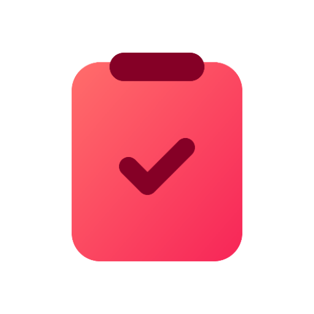

# 📋 SnipIt — Smart Clipboard Manager for Android

  

  
  
  
  
  
  
  

---

## 📸 App Screenshots

  
  
  
  

  
  
  
  

  
  

---

## 📚 Table of Contents

- [✨ Features](#-features)
- [📁 Import/Export & Sync](#-importexport--sync)
- [⚙️ Settings & Controls](#️-settings--controls)
- [🧪 Testing & Compatibility](#-testing--compatibility)
- [🏗️ Tech Stack](#️-tech-stack)
- [🚧 Contributing](#-contributing)
- [📃 License](#-license)
- [🙌 Acknowledgements](#-acknowledgements)
- [Contact](#contact)

---

## ✨ Features

### ✅ Core Functionality

- **Automatic Clipboard Monitoring**  
  Seamlessly captures all copied text from any app without interruptions.

- **Floating Tray & Floating Icon**  
  - Chat-head style floating bubble for quick access.
  - Draggable floating tray showing your latest snippets.
  - Tray auto-dismisses after inactivity for a clutter-free experience.

- **Advanced Search & Filtering**  
  - Search snippets by keyword, labels, or fuzzy matching.
  - Highlight matching keywords in real time.

- **Pin & Unpin Snippets**  
  Keep your essential snippets pinned at the top of your list.

- **Edit & Delete Snippets**  
  - Edit any saved snippet inline.
  - Swipe-to-delete support with custom UI and confirmation.

- **Multi-Label Support**  
  Organize snippets into folders or multiple labels like Gmail tags.

- **Smart Suggested Actions**  
  - Contextual actions using Regex and ML:
    - 🌐 Open URLs
    - 📞 Call phone numbers
    - ✉️ Send emails
    - 🗓️ Add events to your calendar
  - Powered by TFLite and Duckling NLP.
  - Results cached for offline availability.

---

## 📁 Import/Export & Sync

- **Export Snippets**  
  Save your snippets as plain text, JSON, or CSV files using Android’s Storage Access Framework.

- **Import Snippets**  
  Restore previous backups quickly from JSON, CSV, or TXT.

- **Cloud Backup & Sync**  
  - Automatic Google Drive backups.
  - User-specified backup times via a scheduler.
  - Notifications for successful cloud uploads.

---

## ⚙️ Settings & Controls

- **Theme Switching**  
  Light, Dark, and System Default modes.

- **Floating Tray Toggle**  
  Enable or disable the floating bubble overlay.

- **Permission Handling**  
  Guides users through required overlay and clipboard permissions.

- **Auto-Cleanup Rules**  
  - Automatically remove snippets older than a custom number of days.
  - Auto-delete OTP snippets after a specific duration (24/36/48 hours).

- **Manual Clipboard Clearing**  
  Instantly clear your clipboard with a single tap, with confirmation.

- **Scheduled Backups**  
  Users can set preferred times for daily backups to Google Drive.

---

## 🧪 Testing & Compatibility

- Tested on Android API levels 30 to 34.
- Handles runtime permissions and background restrictions.
- Optimized for battery life and performance.
- Regular leak checks for robust stability.

---

## 🏗️ Tech Stack

- **Language**: Kotlin
- **Architecture**: MVVM (ViewModel, LiveData, Room)
- **UI**: Material Components, BottomSheets, RecyclerViews
- **ML**: Duckling NLP via Flask backend
- **Cloud**: Google Drive API, Storage Access Framework

---

## 🚧 Contributing

Contributions are welcome! Feel free to fork the repository and submit pull requests.  
If you have feature ideas, improvements, or bugs to report — open an issue.

---

## 📃 License

This project currently has no license. Contributions are welcome. Once a license is added, it will apply retroactively.

---

## 🙌 Acknowledgements

- Android Jetpack Libraries
- TensorFlow Lite Team
- Duckling NLP Team
- Google Material Design
- Firebase & Google Drive APIs

---

## Contact

**Sayantan Sen** — [icesanu.2019@gmail.com](mailto:icesanu.2019@gmail.com)
