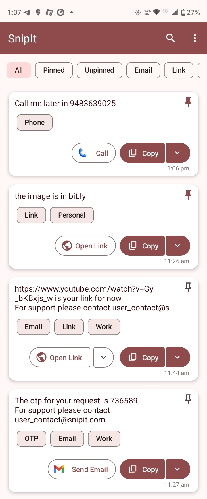
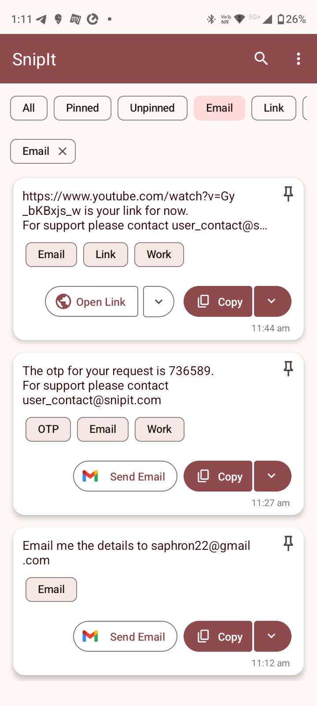
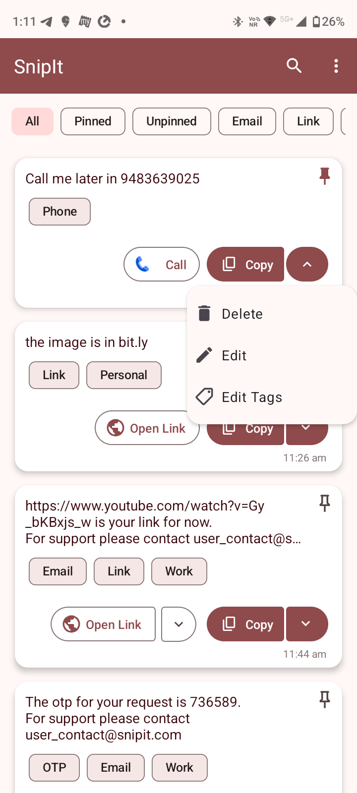
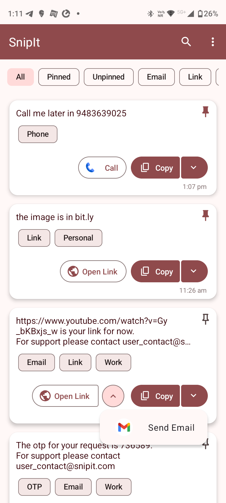
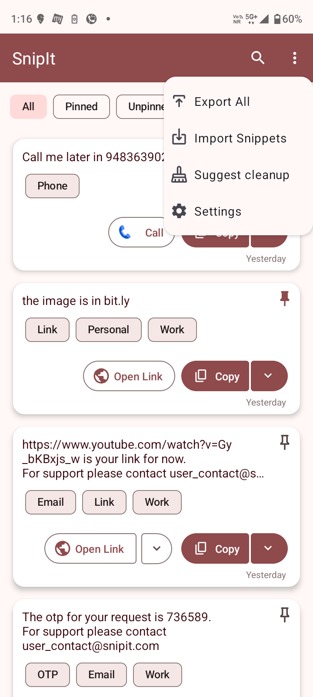
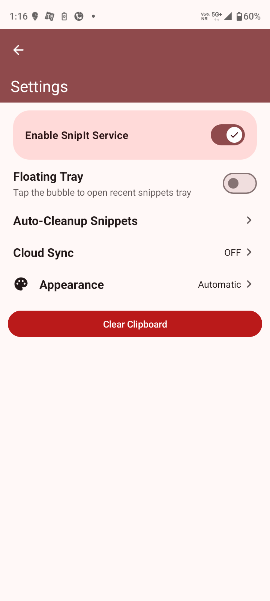
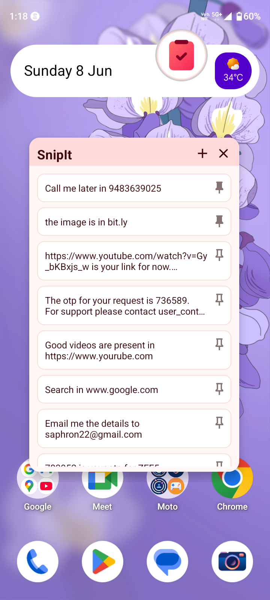

# 📋 SnipIt — Smart Clipboard Manager for Android

  

SnipIt is an intelligent clipboard manager for Android that helps you capture, organize, and interact with your copied snippets. Designed for productivity and ease-of-use, SnipIt automatically saves copied text, provides floating access, and even suggests contextual actions like opening links or adding events to your calendar.

---

## 📸 App Screenshots

  
  
  
  

  
  
  
  

---

## 📚 Table of Contents

- [✨ Features](#-features)
- [✅ Core Functionality](#-core-functionality)
- [📁 Import/Export & Sync](#importexport--sync)
- [⚙️ Settings & Controls](#️-settings--controls)
- [🧪 Testing & Compatibility](#-testing--compatibility)
- [🏗️ Tech Stack](#️-tech-stack)
- [🚧 Contributing](#-contributing)
- [📃 License](#-license)
- [🙌 Acknowledgements](#-acknowledgements)
- [Contact](#contact)

## ✨ Features

### ✅ Core Functionality
- 📋 **Automatic Clipboard Monitoring**
  - Saves all copied text in the background
  - Works across all apps

- 💬 **Floating Bubble with Tray**
  - Chat-head style floating icon
  - On tap, shows a draggable tray with the latest N snippets
  - Tray auto-dismisses after inactivity

- 🔍 **Search and Filter**
  - Powerful keyword-based search
  - Filter snippets by labels/folders

- 📌 **Pin & Unpin Snippets**
  - Keep important snippets always at the top

- ❌ **Delete with Confirmation**
  - Prevent accidental deletion with confirm dialog

- ✏️ **Edit Snippets**
  - Inline edit feature to update saved snippets

- 🏷️ **Multi-Label Support**
  - Assign multiple labels/folders to a single snippet
  - Organize snippets like Gmail-style tags

- 🔍 **Advanced Search and Filter**
  - Keyword-based and label-based filtering
  - Supports fuzzy matching and real-time highlighting

- 🧠 **Suggested Actions**
  - Regex + ML-powered contextual suggestions:
    - 🌐 Open Links
    - 📞 Call Phone Numbers
    - ✉️ Send Emails
    - 🗓️ Add Events to Calendar
    - 🧠 Powered by TFLite and Duckling NLP
  - Duckling-detected entities cached for offline use
  - Smart split-button UI for suggested actions

### 📁 Import/Export & Sync
- 📤 **Export Snippets**
  - Export as plain text, JSON, or CSV
  - Supports SAF (Storage Access Framework)

- 📥 **Import Snippets**
  - Import previously backed-up files (JSON/CSV/TXT)

- ☁️ **Cloud Sync**
  - 🔄 Google Drive Sync (SAF + account-based)
  - Periodic or manual sync via Settings

### ⚙️ Settings & Controls
- 🎨 **Theme Selection (Light/Dark)**
- 👁️‍🗨️ **Enable/Disable Floating Tray**
- 🔒 **Permission Handling & Service Toggle**
- 🧹 **Auto-Cleanup Rules**
  - Auto-delete snippets older than X months
  - Auto-remove OTPs after 24/36/48 hours
- 🧹 **Clear Clipboard Button**
  - Manual clearing with confirmation

---

## 🧪 Testing & Compatibility

- ✅ Tested on Android API 30 to 34
- 💡 Handles runtime permissions gracefully
- 🔋 Optimized for battery and background restrictions
- 🛠️ Regular leak checks and lifecycle awareness

---

## 🏗️ Tech Stack

- 💻 **Language**: Kotlin
- ☕ **Architecture**: MVVM (ViewModel + LiveData + Room)
- 🔲 **UI**: Material Components + BottomSheets + RecyclerViews
- 🧠 **ML**: Duckling NLP via Flask backend
- 🔗 **Cloud**: Google Drive API, SAF Sync

---

## 🚧 Contributing

Contributions are welcome! Please fork the repository and create a pull request. Open an issue if you have ideas, suggestions, or bugs to report.

---

## 📃 License

A license for this project has not been chosen yet.

Until a license is added, contributions are welcome. Assume to be open sourced.

---

## 🙌 Acknowledgements

- Android Jetpack libraries
- TensorFlow Lite Team
- Google Material Design
- Firebase & Google Drive APIs

## Contact

- Sayantan Sen : icesanu.2019@gmail.com
